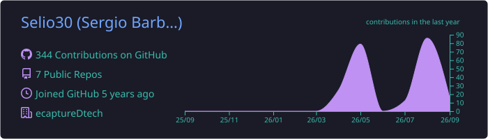

  
  
  

# Hi there 👋 I'm Selio30.

### Thanks for visiting! 😄

I'm a **Multiplatform Application Developer**, ex-student at [42 Málaga](https://www.42malaga.com/) and currently **HelpDesk & Security Manager** at **ecaptureDtech** in Badajoz.

Professionally, I specialize in managing IT infrastructure and ensuring technical security, working with enterprise solutions like **Synology NAS** and **FortiGate Firewalls**. In my personal time, I'm an avid self-learner and homelab enthusiast, managing environments with Proxmox, Ubuntu, Docker, and Nginx Proxy Manager. I enjoy optimizing network topologies (including Pi-hole for network-level tracking protection), managing Active Directory, and deploying custom internal tools across local and Oracle Cloud infrastructure.

### 🛠️ Technical Stack & Tools

#### Programming & Scripting

#### Infrastructure, Security & Databases

### 📊 GitHub Stats

  
  

### 🚀 Featured Repositories

**Education & Training**
* [**42 Piscine C**](https://github.com/Selio30/42-piscine) - *My first steps into the 42 methodology. C fundamentals, algorithms, and logic.*
* [**42 Cursus**](https://github.com/Selio30/42-cursus) - *Core projects developed during my time at 42 Málaga.*
* [**Trabajo fin de curso**](https://github.com/Selio30/TrabajoFinCurso) - *Full-stack project for my Multiplatform Application Development degree.* `Java` | `SQL` | `C#`

### 🌐 Let's Connect

  
  
  

